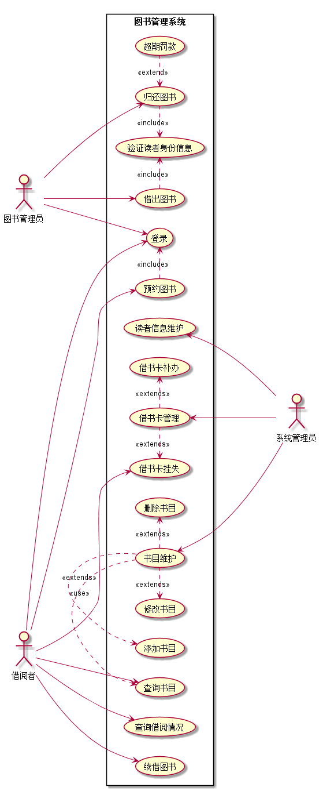
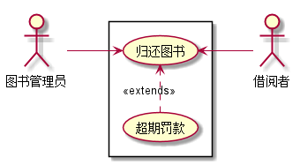

# 实验2：图书管理系统

|  姓名  |      学号      |     班级      |
| :--: | :----------: | :---------: |
|  刘爽  | 201510414209 | 2015-软件工程二班 |

## 1.图书管理系统的用例关系图

### 1.1用例图PlantUML源码：

```
@startuml

left to right direction
:系统管理员: as SysAdmin
:图书管理员: as Admin
:借阅者: as User

rectangle 图书管理系统{
User --> (登录)
User --> (查询借阅情况)
User --> (预约图书)
(预约图书).>(登录):<<include>>
User --> (续借图书)
User --> (查询书目)
User --> (借书卡挂失)

Admin --> (登录)
(借出图书).>(验证读者身份信息):<<include>>
(验证读者身份信息)<.(归还图书):<<include>>
Admin --> (借出图书)
(归还图书)<.(超期罚款):<<extend>>
Admin --> (归还图书)


(读者信息维护) <- SysAdmin
(借书卡管理).>(借书卡补办):<<extends>>
(借书卡管理) <- SysAdmin
(借书卡挂失)<.(借书卡管理):<<extends>>
(书目维护) <--- SysAdmin
(书目维护).>(删除书目):<<extends>>
(修改书目)<.(书目维护):<<extends>>
(添加书目)<.(书目维护):<<extends>>
(查询书目)<.(书目维护):<<use>>
}

@enduml
```

### 1.2用例图：




## 2.参与者说明：

### 2.1图书管理员

主要职责是：

对逾期还书的借阅者收取罚款。

对借阅者的借书还书操作进行处理。

### 2.2借阅者

主要职责是：

通过查询图书并借取或者归还图书。

### 2.3系统管理员

主要职责是：

图书的添加、删除和修改，书目的添加和删除，借阅者的添加、删除和修改。

查询借阅者、图书和图书管理员的信息。

## 3.用例规约表

### 3.1“借出图书”用例

|  标题  |                    内容                    |
| :--: | :--------------------------------------: |
| 用例名  |                   借阅图书                   |
| 参与者  |         图书管理员（主要参与者）、借阅者（次要参与者）          |
| 前置条件 |               图书管理员已被识别和授权               |
| 后置条件 |         存储借书记录，更新库存数据，所借图书状态为借出          |
| 主事件流 | 1.图书管理员将读者借书卡提供给系统；<br>2.系统验证读者身份和借书条件；3.图书管理员将读者所借图书输入系统；4.系统记录借书信息，并且修改图书的状态和此书的可借数量；5系统累加读者的借书数量；6.重复3~5，直到图书管理员确认全部图书登记完毕；7.系统打印借书清单，交易成功完成 |
|  备注  |               图书馆每本书都是可验证的               |


### 3.2“归还图书”用例

|  标题  |                    内容                    |
| :--: | :--------------------------------------: |
| 用例名称 |                   归还图书                   |
| 参与者  |         图书管理员（主要参与者）、借阅者（次要参与者）          |
| 前置条件 |               图书管理员已被识别和授权               |
| 后置条件 |         存储还书记录，更新库存数据，所借图书状态为未借出         |
| 主事件流 | 1.图书管理员将读者借书卡提供给系统；2.系统验证读者身份和还书条件；3.图书管理员将读者所借图书输入系统；4.由系统计算出图书所借日期是否逾期，若逾期则需要借阅者缴纳逾期罚款；5.系统记录还书信息，并且修改图书的状态和此书的可借数量；6.系统打印还书清单，交易成功完成 |
|  备注  |               还书须由图书管理员完成                |

**“归还图书”用例流程图源码**

```
@startuml
:图书管理员: as Admin
:借阅者: as User
left to right direction
rectangle {
Admin -->(归还图书)
(超期罚款).>(归还图书):<<extends>>
(归还图书) <--User
}
@enduml
```

**“归还图书”用例流程图**


