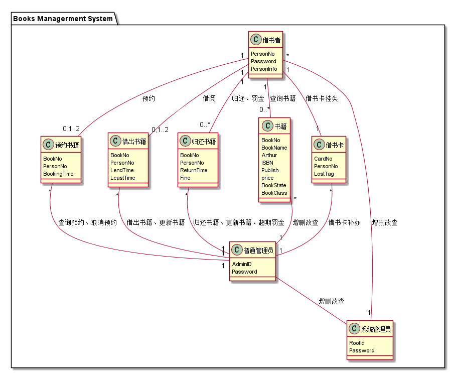
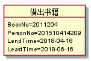
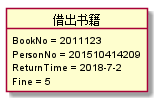

# 实验3：图书管理系统领域对象建模

|  姓名  |      学号      |     班级      |
| :--: | :----------: | :---------: |
|  刘爽  | 201510414209 | 2015-软件工程二班 |

## 1.图书管理系统的类图

### 1.1 PlantUML源码：

```
@startuml

package "Books Managerment System" {
class 预约书籍 {
  BookNo
  PersonNo
  BookingTime
}

class 借出书籍 {
  BookNo
  PersonNo
  LendTime
  LeastTime
}
class 归还书籍 {
  BookNo
  PersonNo
  ReturnTime
  Fine
}
class 书籍 {
   BookNo
   BookName
   Arthur
   ISBN
   Publish
   price
   BookState
   BookClass
}
class 借书卡{
    CardNo
    PersonNo
    LostTag
}
class 借书者 {
   PersonNo
   Password
   PersonInfo
}
class 普通管理员{
    AdminID
    Password
 }
class 系统管理员 {
   RootId
   Password
}

借书者"1" -- "0..*"书籍:查询书籍
借书者"1" -- "0,1..2"预约书籍:预约
借书者"1" -- "0,1..2"借出书籍:借阅
借书者"1" -- "0..*"归还书籍:归还、罚金
借书者"1" -- "1" 借书卡:借书卡挂失
借书卡"*"-down-"1"  普通管理员:借书卡补办
书籍  "*"-down-"1"  普通管理员:增删改查
借出书籍 "*"-down-"1" 普通管理员:借出书籍、更新书籍
归还书籍"*"-down-"1"  普通管理员:归还书籍、更新书籍、超期罚金
预约书籍"*"-down-"1"  普通管理员:查询预约、取消预约
借书者  "*"-down-"1"  系统管理员:增删改查
普通管理员 --系统管理员:增删改查
}

@enduml
```

### 1.2 类图如下



### 1.3类图说明

无

## 2.图书管理系统的对象图

## 2.1 类借出图书的对象图

### 2.1.1 PlantUML源码

```
@startuml

object 借出书籍{
    BookNo=2011204
    PersonNo=201510414209
    LendTime=2018-04-16
    LeastTime=2018-06-16
}
@enduml
```

### 2.1.2 对象图



## 2.2 类归还书籍的对象图

### 2.2.1 PlantUML源码

```
@startuml

object 借出书籍{
    BookNo = 2011123
    PersonNo = 201510414209
    ReturnTime = 2018-7-2
    Fine = 5
}
@enduml
```

### 2.2.2 对象图




