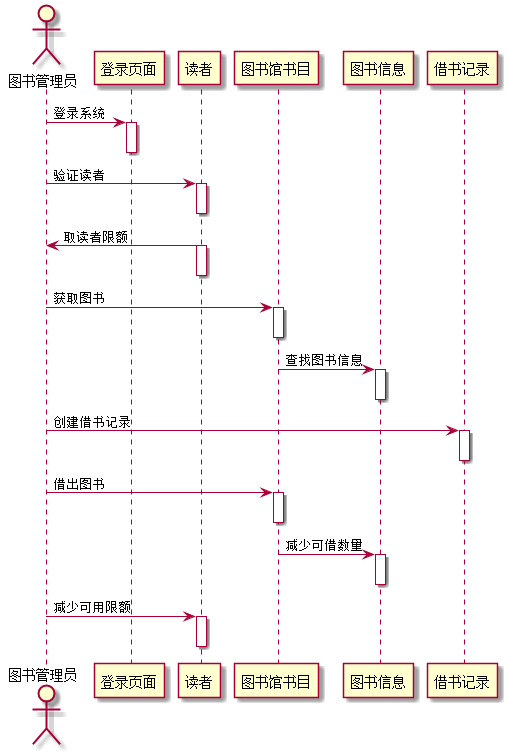
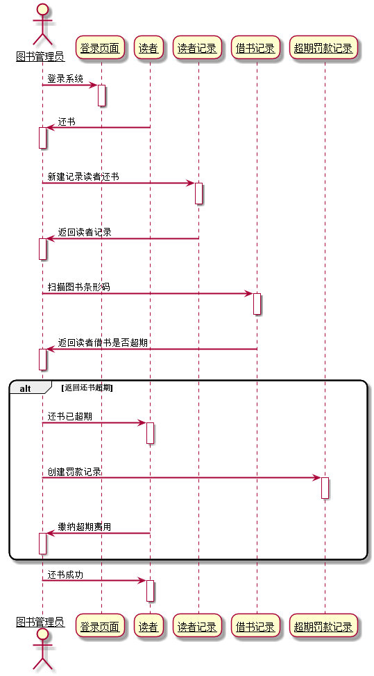

# 实验4：图书管理系统顺序图

|  姓名  |      学号      |     班级      |
| :--: | :----------: | :---------: |
|  刘爽  | 201510414209 | 2015-软件工程二班 |

## 1.借书用例

### 1.1PlantUML源码

```
@startuml
actor 图书管理员

图书管理员 -> 登录页面: 登录系统
activate 登录页面
deactivate 登录页面

图书管理员 -> 读者:验证读者
activate 读者
deactivate 读者

读者 -> 图书管理员:取读者限额
activate 读者
deactivate 读者

图书管理员 -> 图书馆书目:获取图书
activate 图书馆书目
deactivate 图书馆书目

图书馆书目 -> 图书信息:查找图书信息
activate 图书信息
deactivate 图书信息

图书管理员 -> 借书记录:创建借书记录
activate 借书记录
deactivate 借书记录

图书管理员 -> 图书馆书目:借出图书
activate 图书馆书目
deactivate 图书馆书目

图书馆书目 -> 图书信息:减少可借数量
activate 图书信息
deactivate 图书信息

图书管理员 -> 读者:减少可用限额
activate 读者
deactivate 读者

@enduml
```

### 1.2借书用例顺序图



###1.3借书用例顺序图说明

本时序图包含了图书管理员为读者借书的这个过程，图书管理员登录系统，通过借书卡确认读者身份，通过扫描仪读取图书ID，然后借出图书并添加借书记录。

## 2还书用例

### 2.1PlantUML源码

```
@startuml
skinparam sequenceArrowThickness 2
skinparam roundcorner 20
skinparam maxmessagesize 60
skinparam sequenceParticipant underline

actor 图书管理员

图书管理员 -> 登录页面: 登录系统
activate 登录页面
deactivate 登录页面

读者 -> 图书管理员: 还书
activate 图书管理员
deactivate 图书管理员

图书管理员->读者记录:新建记录读者还书
activate 读者记录
deactivate 读者记录

读者记录->图书管理员:返回读者记录
activate 图书管理员
deactivate 图书管理员

图书管理员->借书记录:扫描图书条形码
activate 借书记录
deactivate 借书记录

借书记录->图书管理员:返回读者借书是否超期
activate 图书管理员
deactivate 图书管理员

alt 返回还书超期
图书管理员->读者:还书已超期
activate 读者
deactivate 读者

图书管理员->超期罚款记录:创建罚款记录
activate 超期罚款记录
deactivate 超期罚款记录

读者->图书管理员:缴纳超期费用
activate 图书管理员
deactivate 图书管理员
end

图书管理员->读者:还书成功
activate 读者
deactivate 读者
@enduml
```

### 2.2还书用例顺序图



### 2.3还书用例顺序图说明

本时序图包含了图书管理员为读者还书的这个过程，读者前来还书，系统管理员验证借书记录：

若借书已超期，将创建新的超期记录，并告知读者已超期，需要缴纳罚款，读者进行缴纳超期的费用，即可还书成功。

若借书未超期，直接还书成功。
